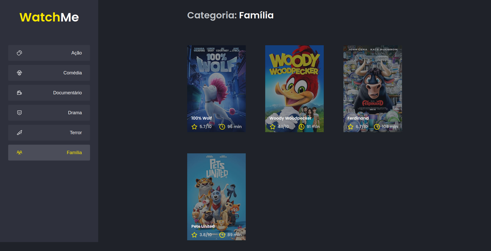

# Watche me 📝

<p align="center">
  <a></a>
</p>

## 🛠️ Challenge

Essa será uma aplicação onde o seu principal objetivo é refatorar uma página para listagem de filmes de acordo com gênero. 

A aplicação já está totalmente funcional mas grande parte do seu código está diretamente no arquivo App.tsx. Para resolver isso da melhor forma, é necessário dividir a aplicação em pelo menos duas partes principais: sidebar e o conteúdo principal que possui o header e a listagem de filmes:

- A aplicação possui apenas uma funcionalidade principal que é a listagem de filmes;
- Na sidebar é possível selecionar qual categoria de filmes deve ser listada;
- A primeira categoria da lista (que é "Ação") já deve começar como marcada;
- O header da aplicação possui apenas o nome da categoria selecionada que deve mudar dinamicamente.

## 🛠️ Stack

- React
- Typescript
- Yarn
- Webpack
- SCSS, Babel
- json-server
- axios

## Run

```
  yarn install
  yarn dev
```

## :woman: Author

[@laisfrigerio](https://github.com/laisfrigerio/)

## 📄 License

This project is licensed under the MIT License - see the LICENSE file for details